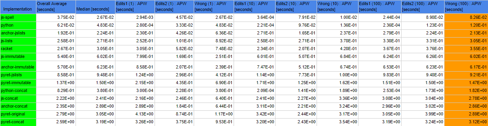

# Purpose
The purpose of this repo is to compare the runtime of Norvig's spell checker implementation mentioned [here](https://norvig.com/spell-correct.html) across different languages, in this case JS, Python, Pyret, and Racket.

# Implementation
There are 10 total implementations:
* `python.py` - the original Python implementation by Norvig, 
* `js-spell.js` - a JS implementation by [Panagiotis Astithas](http://astithas.blogspot.com/2009/08/spell-checking-in-javascript.html) that diverges slightly in its spell correction algorithm
* `js-lists.js` - a JS implementation that uses JavaScript's builtin arrays and objects
* `js-immutable.js` - a JS implementation that uses [Facebook's immutable](https://facebook.github.io/immutable-js/) collection
* `racket.rkt`
* `pyret-original.arr` - a Pyret implementation that uses its builtin lists and string dictionaries
* `pyret-lists.arr` - a Pyret implementation that imports a JS file that provides the use of builtin JS arrays and objects
* `pyret-immutable.arr` - a Pyret implementation that imports a JS file that provides the use of Facebook's immutable collection
* `anchor-lists.arr` - an experimental CLI implementation of Pyret that uses builtin JS arrays and objects for its lists and dictionaries, respectively
* `anchor-immutable.arr` - similar to `anchor-lists.arr` but the underlying structure of lists and dictionaries uses Facebook's immutable collection

All versions follow the same structure and procedure as discussed by Norvig. Each implementation was tasked with spell checking 3 different types of words, words that were 1 edit away from a correct word found in the corpus (`big.txt`), words that were 2 edits away, and words that were 3 or more edits away. Each spell checker was timed for the total time it took to correct 1, 10, and 100 words for each type. In order to assure that they were correctly spell checking, when correcting 100 words a check is made that the word returned by the corrector is not the same as the initial given word and that it is found in the corpus if the word was 1 or 2 edits away, and vice versa if the word was 3 or more edits away.

# Data
https://docs.google.com/spreadsheets/d/1hDniIEtKY8GPeuk0Al-XyGTundKR4BD-rSUGG63uV6c/edit?usp=sharing

# Discussion
There are a few interesting things to note from these results.

`js-spell.js` seems to perform the fastest with `python.py` being a close second. However, it was noted that that `js-spell.js` had a different way of implementing the correction process. Instead of having to calculate the probability of every word that is 1 edit away, Astithas only considered words found in the corpus to be possible candidates. For example, edits1( "hellp" ) would return a list of words including "hello", "help", and "hellw" amongst others. In this case, "hello" and "help" would be considered candidates while "hellw" would not as it cannot be found in the corpus. Therefore, there are less candidates to calculate their probability causing a shorter runtime.  On the other hand, `python.py` seems to save some computations by placing all of its candidates in a set, removing any duplicate edits and thus preventing the program from having to compute the same probability twice.

Surprisingly `anchor-jslists.arr` ran slightly faster than `js-lists.js`, since `anchor-jslists.arr` is using the builtin JS arrays and objects in the same way as `js-lists.js`, which would imply that `anchor`'s implementation simply introduces an overhead in its runtime compared to JS's, as seen by comparing `js-immutable.js` and `anchor-immutable.arr`. The reason behind this is how the concatenation of lists is handled by `anchor`, where pushes are made instead of calling JS array's `concat` method. Switching all instances of pushes to `concat` on both the JS and Anchor implementations using lists increases the total runtime of correction per word. `js-lists.js` changes from 0.277 seconds to around 3.403 seconds per word, and `anchor-jslists.arr` changes from 0.204 seconds to around 3.755 seconds per word, now matching the expectation of Anchor introducing some slight overhead to JS's implementation.

# Conclusion
The results of this repo has demonstrated that in order for Pyret to have a comparable runtime to other languages, implementing lists and string dictionaries with Facebook's immutable collection seems to be the best course of action. `js-spell.js`'s algorithm for computing corrections seems to be another thing to keep in mind for the other implementations, which should theoretically improve the runtime of every other implementation.